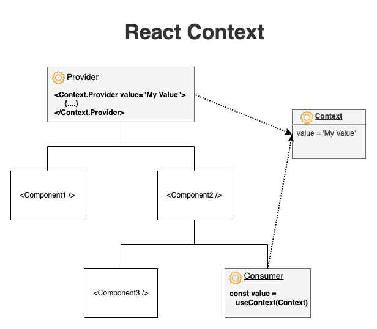

# Context API

* Context API addresses prop drilling.
* Context API eliminates the props drilling by creating a store/context which holds all the necessary data required by the component.

> ***Prop Drilling:*** Passing props via components to the targeted component is known as Prop Drilling
>
> Reffering to below image assume that `Component1` stores a state and `Consumer` wants to access the same state, then we need to store the state in higher component i.e. `Provider`. Now `Provider` will pass the state to `Component1` via prop. Similarly `Provider` will pass the state to `Consumer` via prop, but it will not directly pass the state, firstly the state will be shared with `Component2` then `Component2` finally shares the state via prop to `Consumer`.
> Here `Component2` unneccessarily has to import the state and pass it forward.
> Addressing this react introduces ContextAPI.

* There are three entities involved in Context API:
  * **Provider:** Sets the value that is to be shared to all consumers by the context/store
  * **Context/Store:** It stores all the data/values collected from the provider. Use `createContext` for creating a context/store.
  * **Consumer:** uses the values form the context/store.

1. Create a store.
2. Create a file named `todo-items-store.jsx`.
    * Create a context object using `createContext` => `export const TodoItemsContext = createContext({});`
3. Wrap the return of App.jsx with `<TodoItemsContext.Provider value={} > . . . </TodoItemsContext.Provider>`
4. Remove the props of all the tags and add value of that in the `<TodoItemsContext.Provider value={}`
    * `value={ { todoItems: todoItems, addNewItem: addNewItem, deleteItem: deleteItem } }`
    * These are context object
5. Changes in `todo-items-store.jsx` => `createContext( { todoItems: [], addNewItems: () => {}, deleteItem: () => {} } );`
6. Now, `TodoItems.jsx`
    * remove all props
    * access the context store by using `useContext`.
    * store the required value from the context object in a var and use where required
7. similarly do this for all necessary files.
8. Note: In `TodoItems.jsx` => in return statement there is a tag `<Item>` remove the `onDeleteClick` prop,
    then in `Item.jsx` access the context store and store the value of `const deleteItem = contextObj.deleteItem;`

> Context provider and State management are generally used together.
> But Context APIs is not just eliminates prop drilling done for state management
> Rather it can also store constant values that are needed throughout the app.
